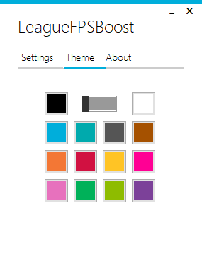
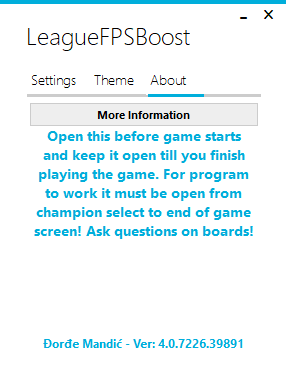
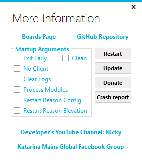

# LeagueFPSBoost  
LeagueFPSBoost is a program written in C# that makes it easier to manage stuff on system and in game visual settings to improve FPS in League Of Legends.

## Getting Started

These instructions will get you a copy of the built project up and running on your local machine.

## Prerequisites

What things you need to install the software and how to install them

- .NET Framework 4.7.2 or newer
- Windows Vista, 7, 8, 8.1 or 10

Download .NET Framework 4.7.2 from [here](https://dotnet.microsoft.com/download/thank-you/net472)

## Installing  

A step by step series of examples that tell you how to get a program running

1. Download the zip file from [releases](https://github.com/DjordjeMandic/LeagueFPSBoost/releases/latest)
   - Download the zip file from releases. After downloading finishes open the folder containing the zip file and extract the program on your desktop or where you want. Make sure that the program's file name is exactly like original "LeagueFPSBoost".

2. Double click on the program to run it for first time.
   - When you run the program for first time it will try to locate folder where League Of Legends Client is located. If it can't find it you will be prompted to select the file named `LeagueClient.exe`. After that a message box will pop up. That message box pops up after every update and sometimes some more message boxes if needed.

3. One final step
   - Now after program has loaded up you just can leave it there and run the League Of Legends Client and leave the program running in background until you finish playing League Of Legends(not one game but for the day... and etc). It's important to leave program running in background at same time that League Of Legends Client does. Program works like supervisor for the game so leave it running.

This is how it should look like with toggles set for best performance.

## What tab and window is for what

 - Settings tab contains the main controls of the program. They affect the game's performance.
    > 

 - Theme tab contains buttons and switch used to change the theme of the program.
    > 
    
 - About tab contains information about program and link at the bottom that shows current version. More information button opens new window with advanced controls for the program. More about it down below.
    > 

 - More Information window contains custom advanced program controls.
    > 

## Settings Tab

All toggles above 4 buttons on the settings tab are used for tweaking the system options to improve game's performance, toggles under the buttons are used to tweak game's visual options.

 - **High Performance PP (where PP means Performance Plan):**
   - Windows sets all PCs to a “Balanced” power plan by default. But there are also “Power saver” and “High performance” plans. Your PC     manufacturer may have even created their own power plans. High Performance mode doesn’t lower your CPU’s speed when it isn’t being used, running it at higher speeds most of the time. It also increases screen brightness. Other components, such as your Wi-Fi or disk drive, may also not go into power-saving modes. Using high performance mode will lower your battery's lifespan and drain it faster if you are on laptop and produce more heat. Right clicking on `High Performance PP` will open Power Options in old classic control panel, left click will reset last active power plan(current power plan that will be set when turning off the high performance control). If your PC is not overheating you can enable this option. If you're not sure what it does then don't touch it.
 - **Manage Proc. Priority (where Proc. is short for Process):**
   - Windows shares processor resources between all running processes based upon their priority level. If a process (application) has a higher priority level, it gets more processor resources for better performance compared to a process having lower priority. Turning this on will set League Of Legends Game's process to High priority and League Of Legends Client's process to Below Normal priority when the game starts. When the game ends then League Of Legends Client's process priority will be set back to Normal priority. This is recommend on machines that have weak cpu. This works by monitoring starting processes via WMI(Windows Management Instrumentation), if the WMI is broken program will prompt you to fix the problem, if problem is not fixed you will be able to use the program but this option will be grayed out. (unusable)
 - **Sound Notifications:**
   - When this is enabled on every try to change game's process priority or if there is an error sound notification will be played. Program will try to look for a file named `notiSuccess.mp3` or `notiFail.mp3` in `LeagueFPSBoost` folder located withing `Config` folder which you can open by pressing `LoL Config` button. If there is no file found then default notification sound will be played(integrated in the program).
 - **Disable FullScr Optim. (where FullScr Optim. means Full Screen Optimizations):**
   - Full screen optimization lets your operating system optimize applications and games that take over the whole screen. It's part of the Windows 10 Anniversary Update, and it's on by default. Sometimes it makes things worse, so you can disable it by clicking on the toggle switch. Right clicking on `Disable FullScr Optim.` will open League Of Legends Game's file properties. This only works on Windows 10 and on other operating system versions it will be grayed out. (unusable)
 - **Disable Game Bar:**
   - Game Bar is a software program included with Windows 10 that lets you take screenshots and record and broadcast video games. Some users have reported that it also reduces League Of Legend's performance so disabling it can also help. Right clicking on `Disable Game Bar` will open Windows Settings App. This only works on Windows 10 and on other operating system versions it will be grayed out. (unusable)
 - **App Logs:**
   - Clicking on this button will open folder where program's logs are located.
 - **LoL Config:**
   - Clicking on this button will open folder where League Of Legends stores its configuration and there you can find `LeagueFPSBoost` folder where you can put notification sound files. Read about Sound Notifications above.
 - **User Config:**
   - Clicking on this button will open folder where program stores its configuration about theme, league client path, current settings and etc...
 - **Backup And Save Config:**
   - Clicking on this button will firstly prompt you where to save backup of game's configuration file `game.cfg` and then it will write new values to the original `game.cfg`. Keep in mind that changing toggles under this button will not affect the game's `config.cfg` until you press this button and complete the backup process. If something goes wrong you can always restore backed up file by deleting `game.cfg` in folder opened by pressing `LoL Config` button and copying the backed up file in that folder. Then just rename the backed up file to `game.cfg`. Every time you click on the program window to focus it values from `game.cfg` file will be reloaded.
 - **Character Inking:**
   - Option bellow under the in game 'Video' Settings Tab menu is what makes the champion/character stand out from the environment and crowded scenarios but it costs performance. In earlier days it was not possible to change this in game but now it is. Disabling this will improve performance(decrease load on graphics card). If you don't notice any difference in frame rate after disabling this you can enable it back.
 - **HUD Animations:**
   - Disabling this can also improve performance(decrease load on graphics card). I know that there is also option to do this in game but most people don't care about it. If you don't notice any difference in frame rate after disabling this you can enable it back.
 - **Shadows:**
   - As we all know what shadows are. Again, disabling this will improve the performance(decrease load on graphics card). If you don't notice any difference in frame rate after disabling this you can enable it back.
 - **Grass Swaying:**
   - This option makes grass move in game like when wind is blowing. Again, disabling this will improve the performance(decrease load on graphics card). If you don't notice any difference in frame rate after disabling this you can enable it back.

## Theme Tab

Theme tab contains controls used to change program's appearance. Clicking on colored buttons changes the foreground color and clicking on the toggle changes the background color(bright or dark mode).

## About Tab

About tab contains button to open `More Information` window and little bit of text with developer's name and program's version on bottom. Clicking on the developer's name opens op.gg page of developer's account.

## More Information Window

More Information window contains few buttons, links and startup options(command line arguments) for the program.

 - **Restart Button:**
   - Clicking on this button will restart program with selected startup arguments.
 - **Update Button:**
   - Clicking on this button will check for updates.
 - **Donate Button:**
   - Clicking on this button will open up [PayPal page](https://www.paypal.me/DjordjeMandic) where you can donate to support developer.
 - **Crash report Button:**
   - Clicking on this button will crash application intentionally to create crash report for developer. Last log file and crash report file created at time of crash will be sent to developer. [DrDump](https://drdump.com/crash-reporting-system) will also receive crash report.
 - **Console Button:**
   - This button is only visible when console is available. Clicking on this button will show/hide the console. Closing the console by pressing X will also close the program. Console shows log in real time.
 - **Startup Arguments:**
   - **Clean:**
     - When this is checked all other startup arguments are ignored and program will start without any arguments.
   - **Exit Early:**
     - When this is checked after restarting program will exit before startup of main window. Use this if you want log file containing only startup before logger has been started and checking for program's configuration.
   - **No Client:**
     - When this is checked after restarting program will be allowed to change the priority of `League Of Legends.exe` without having `LeagueClient.exe` running.
   - **Clear Logs:**
     - When this is checked after restarting program will delete `LeagueFPSBoost Logs` folder. New one will be created as soon as new log entry is printed.
   - **Process Modules:**
     - When this is checked after restarting program will also log all modules(dll files) loaded and used by `LeagueFPSBoost.exe`. 
   - **Restart Reason Config:**
     - This will be checked when program restarted itself due to an problem with program's configuration.
   - **Restart Reason Elevation:**
     - This will be checked when program restarted itself because it was not run with administrative privileges.

## Built With

* [Visual Studio 2019 Community Edition](https://visualstudio.microsoft.com/vs/) - The IDE used
* [Dependencies](https://github.com/DjordjeMandic/LeagueFPSBoost/network/dependencies) - The nuget packages used

## Versioning

Versioning system:
 - Major Version: Incremented if there is a lot of new features added at once compared to last update.
 - Minor Version: Some new features added and bug fixes.
 - Last 2 numbers changed only for hot fixes or rebuild.

## Authors

* **Djordje Mandic** - *Initial work* - [GitHub](https://github.com/DjordjeMandic) - [YouTube](https://www.youtube.com/channel/UCKv_SvHJWBPpDN_Mcyjr72A) 

## Donate And Subscribe  

A donation would be appreciated to support the project. If you can't donate then please leave a sub ^_^

## License

This project is licensed under the MIT License - see the [LICENSE.md](LICENSE.md) file for details

## Acknowledgments

* Program started as small command line process watcher for myself to keep frame rate at playable level, as I was implementing new stuff my friends started using it. Then I decided to post it on internet and keep adding new features from time to time.
